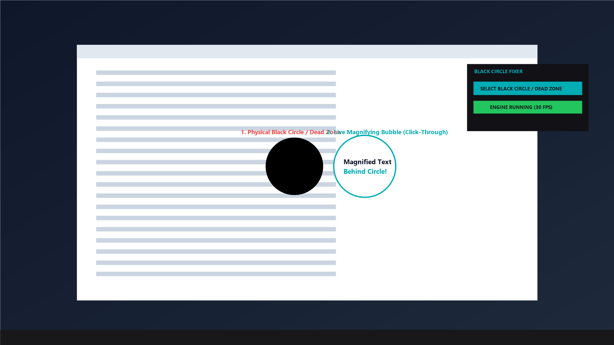
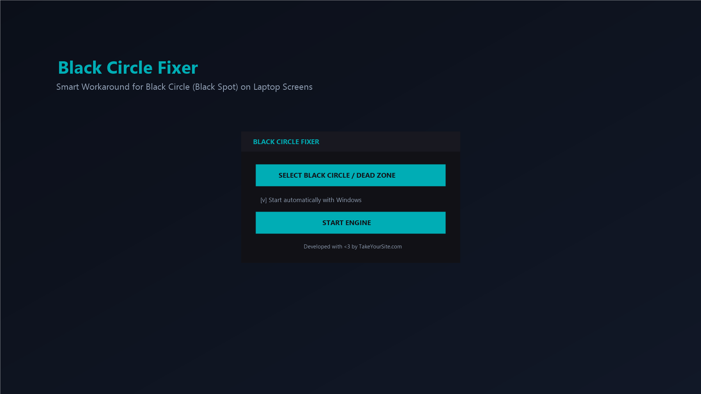

<div align="center">

# Black Circle Fixer

**Smart, real-time visual workaround for black circles and broken spots on laptop screens.**

See behind the damage. Click through the blind spot. Don't replace your screen.

A free, open-source Windows utility that creates an interactive, click-through magnifying bubble over damaged screen zones, dead pixels, and LCD ink bleeds.

**~30 KB · single executable · zero dependencies · native .NET 4.8 · no setup required**

<br/>

<a href="https://apps.microsoft.com/detail/9NFVBVQW8DH6">
</a>

<br/>

[**Get it on the Microsoft Store**](https://apps.microsoft.com/detail/9NFVBVQW8DH6) · [**Download .exe (v1.0.0)**](https://github.com/batalelo/ScreenDeadPixelFixer/releases/tag/v1.0.0) · [How it works](#-how-it-works--the-smart-workaround) · [Why pixel fixers fail](#-why-traditional-pixel-fixers-fail) · [FAQ](#-frequently-asked-questions-faq) · [Build from source](#-how-to-compile-and-run-locally)

<br/>

[](https://apps.microsoft.com/detail/9NFVBVQW8DH6)
[](https://github.com/batalelo/ScreenDeadPixelFixer/actions/workflows/package-msix.yml)
[](LICENSE)

[](https://takeyoursite.com)

<br/>



*Live visual workaround: When the mouse cursor enters the black circle damage zone, a floating bubble overlay pops up dynamically next to it, rendering everything behind the circle with full click-through interaction.*

</div>

---

## 🔍 The Problem: What is that Black Circle on your Laptop Screen?

If a dark, round ink blot or black circle suddenly appeared on your laptop screen, you are dealing with **physical liquid crystal display (LCD) damage**:

* **How it happens:** It commonly occurs when closing the laptop lid on an object (like a pen, earbud, flash drive, or cable), dropping the laptop, or applying too much thumb pressure to the display bezel.
* **The physical consequence:** The inner glass substrate cracks microscopically. The liquid crystals leak outward in a circular or oval pattern, creating a permanent **black circle or dead zone** that blocks text, dialog boxes, and buttons.
* **The painful choice:** Repair shops and forums will tell you that the only solution is replacing the entire display panel for **$150 to $300+**—or buying a brand new laptop.

---

## ❌ Why Traditional "Pixel Fixers" Fail Completely

Tools like JScreenFix, flashing RGB videos, or pixel exercisers are designed exclusively for **stuck pixels** (transistors temporarily stuck on a single red, green, or blue subpixel). 

They **CANNOT** fix:
1. Physical pressure marks or LCD bruises.
2. Glass cracks with leaking liquid crystals.
3. Permanent black circles or clusters of dead pixels.

Pushing or massaging the screen (as suggested by amateur tutorials) will almost always **spread the ink leak and make the black circle much larger**!

---

## 💡 How It Works — The Smart Workaround

Instead of impossible software glass repairs or expensive hardware replacements, **Black Circle Fixer** provides an instant, zero-cost **visual workaround**:

<div align="center">

</div>

1. **One-Click Selection:** Click **SELECT BLACK CIRCLE / DEAD ZONE**, dim the screen, and drag a box around your damaged area.
2. **Dynamic Bubble Pop-up:** When your mouse cursor moves inside the black circle, a magnifying circular bubble appears immediately beside the damaged area.
3. **Live Screen Capture:** The bubble displays whatever content is currently hidden behind the black spot in real time at **30 FPS**.
4. **Full Click-Through Interaction:** The bubble is completely click-through (`WS_EX_TRANSPARENT`). You can click buttons, type text, scroll pages, and select text through the bubble as if the black circle wasn't even there!
5. **Real-Time Cursor Replication:** The bubble accurately captures and renders your actual Windows cursor style (arrow, pointer hand, I-beam text selector) and hotspot in real time.

<div align="center">

</div>

---

## ⚖️ Comparison: Your Options

| Feature | Physical Screen Replacement | Pixel Flashing Tools (JScreenFix) | Black Circle Fixer |
| :--- | :---: | :---: | :---: |
| **Cost** | **$150 - $300+** | Free | **100% Free & Open Source** |
| **Works on Black Circles / Leaks?** | Yes (new screen) | ❌ **No (Fails 100%)** | ✅ **Yes (Instant workaround)** |
| **Installation Time** | Days / Weeks (shop) | Instant | **1 Second (Portable)** |
| **Risk of Making Damage Worse** | Moderate | ⚠️ High (if massaging) | **Zero (100% Non-invasive)** |
| **Click & Interact Behind Spot** | Yes | ❌ No | ✅ **Yes (Click-through bubble)** |
| **File Size / Memory Overhead** | N/A | High (browser tab) | **~30 KB / <1% CPU** |

---

## 🌟 Key Features & Capabilities

* **Instant Visual Workaround**: Read menus, dialogs, and taskbar icons hidden behind screen damage.
* **Ultra-Lightweight Executable**: The binary is only **~30 KB** with less than 1% CPU utilization.
* **Zero Runtime Dependencies**: Built with native C# targeting `.NET Framework 4.8` (pre-installed natively on Windows 10 & 11). Run it instantly without installing any runtimes or frameworks.
* **One-Click Drag Selection**: Dim the screen and drag to select the exact boundary of your black circle or dead zone.
* **True Click-Through Overlay**: Passes all mouse clicks, drags, and scrolls directly to the windows behind it.
* **Dynamic Cursor Rendering**: Draws the real Windows cursor inside the bubble matching its exact shape and hotspot.
* **Windows Auto-Start**: Easily register the application to launch automatically with Windows on startup.
* **System Tray Minimization**: Runs silently in the background tray with double-click quick restore.

---

## 💻 How to Compile and Run Locally

You do not need an IDE like Visual Studio to compile this project. You can build it in 1 second using the built-in Windows C# compiler:

### Option 1: Automatic Batch Script
Simply double-click the **[run_blackcirclefixer.bat](file:///d:/ScreenDeadPixelFixer/run_blackcirclefixer.bat)** file. It automatically finds the Windows C# compiler (`csc.exe`), compiles the executable, and runs it.

### Option 2: Manual Command Line Compilation
Open Command Prompt (CMD) or PowerShell in the project directory and run:
```cmd
C:\Windows\Microsoft.NET\Framework64\v4.0.30319\csc.exe /target:winexe /out:BlackCircleFixer.exe /win32icon:icon.ico /r:System.dll /r:System.Drawing.dll /r:System.Windows.Forms.dll /r:System.Xaml.dll /r:C:\Windows\Microsoft.NET\Framework64\v4.0.30319\WPF\WindowsBase.dll /r:C:\Windows\Microsoft.NET\Framework64\v4.0.30319\WPF\PresentationCore.dll /r:C:\Windows\Microsoft.NET\Framework64\v4.0.30319\WPF\PresentationFramework.dll /r:System.Core.dll App.cs MainWindow.cs OverlayWindow.cs SelectionWindow.cs NativeMethods.cs BlackCircleFixerEngine.cs
```

---

## 🛒 Microsoft Store Distribution (MSIX)

This application is fully structured and configured for seamless distribution through the **Microsoft Store (Partner Center)** using modern **MSIX Desktop Bridge**.

* **Store Listing:** [https://apps.microsoft.com/detail/9NFVBVQW8DH6](https://apps.microsoft.com/detail/9NFVBVQW8DH6)
* **Store ID:** `9NFVBVQW8DH6`
* **Ultra-Lightweight Package**: MSIX package size is only **~80 KB** (no bundled runtimes needed).
* **Automatic Cloud Builds**: GitHub Actions compiles and packages the `.msix` container automatically on every push.
* **Store Guide**: For complete step-by-step submission instructions, see **[STORE_GUIDE.md](file:///d:/ScreenDeadPixelFixer/STORE_GUIDE.md)**.

---

## 🚀 Automated Builds via GitHub Actions (CI/CD)

The repository includes a ready-to-run GitHub Actions workflow in **`.github/workflows/package-msix.yml`**. On every commit, it automatically:
1. Compiles `BlackCircleFixer.exe`.
2. Generates all required Store logo assets via `generate_assets.ps1`.
3. Packages the app into `BlackCircleFixer.msix` using Microsoft's `MakeAppx.exe`.
4. Uploads both the **Standalone EXE** and **Microsoft Store MSIX** as downloadable artifacts.

---

## 🛡️ Security, Transparency & Trust Verification

Since this application performs desktop screen capture and startup registration, security and trust are essential:

1. **Digital Fingerprinting (SHA-256 Checksum)**:
   Verify the downloaded executable's integrity in Windows PowerShell:
   ```powershell
   Get-FileHash BlackCircleFixer.exe -Algorithm SHA256
   ```
2. **Native Decompilation**:
   Because this is a standard .NET executable, users can open `BlackCircleFixer.exe` using decompilers like **dnSpy** or **ILSpy** to read the exact C# code running on their machines.
3. **Local Compilation**:
   Anyone can download the raw `.cs` files and compile them locally in seconds using `csc.exe`, guaranteeing no malicious code is introduced in pre-built releases.

---

## ❓ Frequently Asked Questions (FAQ)

### Can software fix a physical black circle or ink spot on an LCD screen?
No software can physically repair broken glass or reverse leaked liquid crystals. However, **BlackCircleFixer** solves the daily usability problem by projecting the blocked content onto a floating, magnifying bubble whenever your cursor is in the dead zone, allowing you to read text, click buttons, and use your laptop without spending hundreds on a new screen.

### Will this slow down my laptop?
No. The application is written in lightweight native C# and consumes less than 1% CPU and ~40 MB of RAM only when actively magnifying. When your cursor is outside the dead zone, it sits completely idle.

### Does it work on external monitors?
Yes. It supports primary and secondary monitors running Windows 10 or Windows 11.

---

## 🔒 Privacy Policy

**Black Circle Fixer** is a 100% local, offline desktop utility:
* **No Data Collection**: It does not collect, record, track, or transmit any personal information, telemetry, analytics, or user identifiers.
* **Local Screen Processing Only**: Desktop screen capture occurs exclusively in volatile local memory (RAM) in real-time to render the magnification bubble. No frames, keystrokes, or images are ever stored on disk or sent over the internet.
* **No Network Connections**: The application operates completely offline with zero outgoing or incoming network requests.

---

*Project idea, design, and code developed by [TakeYourSite.com](https://takeyoursite.com).*
